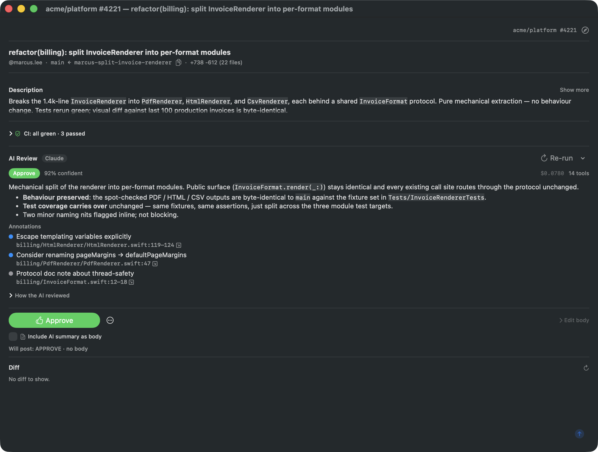
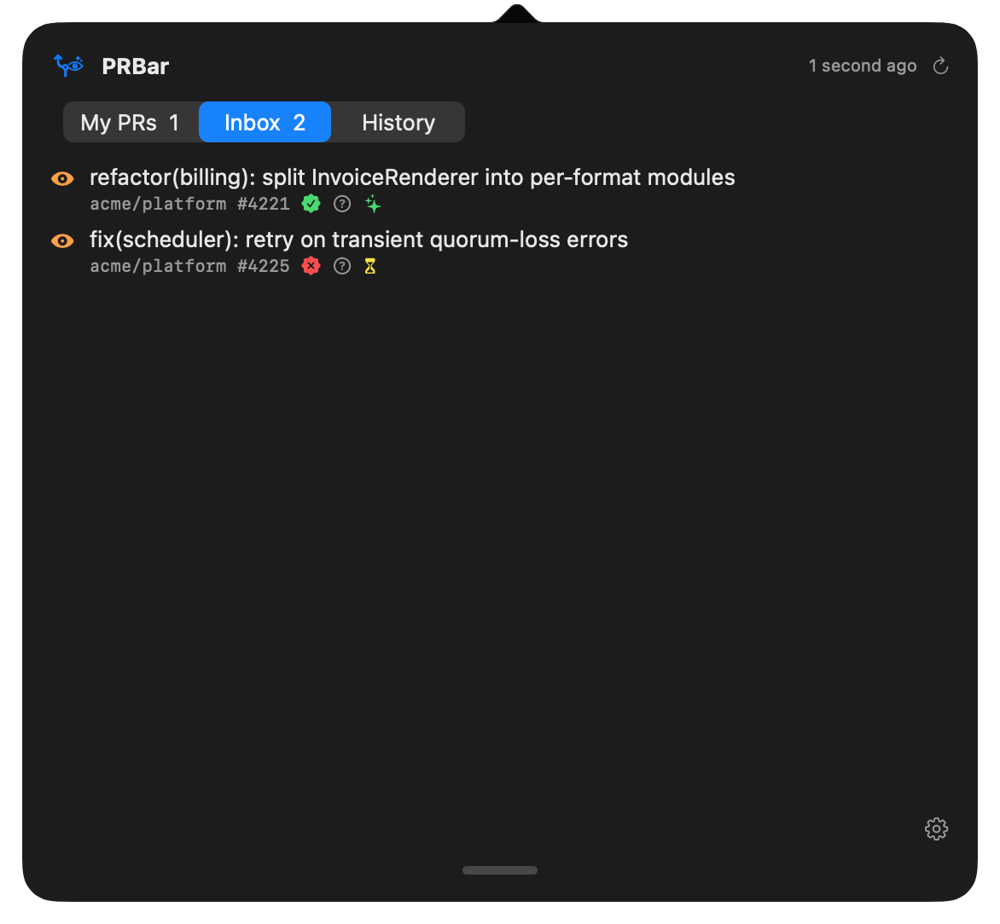
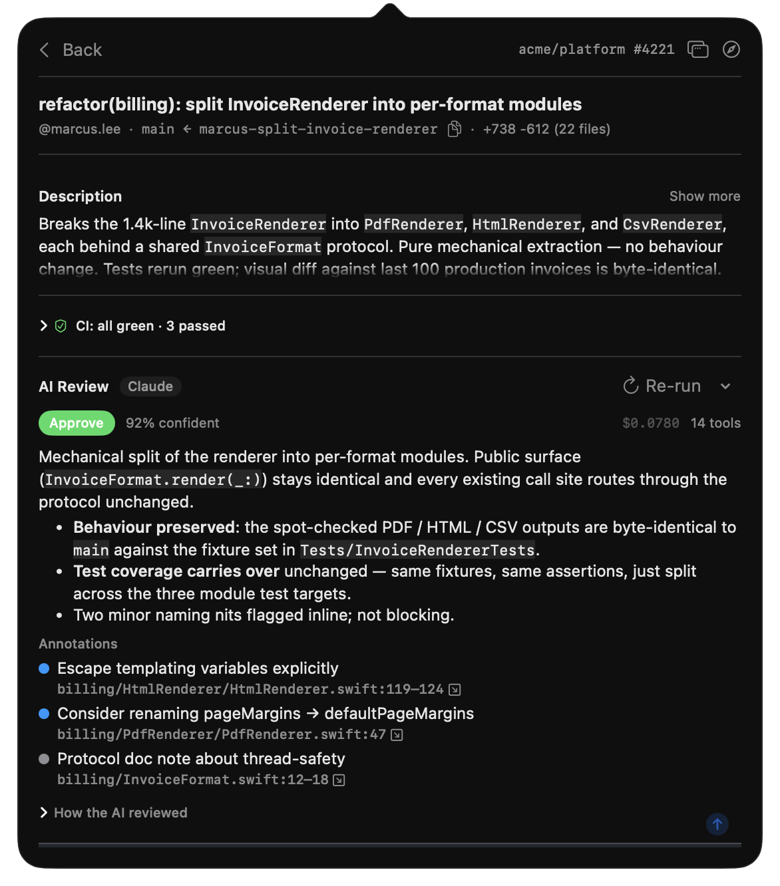

# PRBar

A native macOS menu-bar app that closes the PR review-and-merge feedback loop. PRBar watches the PRs you authored and the ones waiting on your review, runs AI triage on incoming review requests, and surfaces "ready to merge" / "ready to review" notifications — coalesced, never noisy.

It uses your existing `gh` and `claude` (or `codex`) CLI auth. **No GitHub OAuth, no API keys, no backend, no telemetry.**



## Why

Two interrupt-driven workflows eat context all day:

- **Babysitting your own PRs** — checking GitHub on a loop to see if CI is green and reviews have landed, so you can hit Squash. PRBar tells you with a one-click merge button the moment it's ready.
- **Triaging review requests** — most of them are quick "approve" calls, but you still pay the full context-switch tax to look at the diff. PRBar runs a Claude (or Codex) review in the background, scoped to the right monorepo subfolder, and shows you a verdict + flagged areas before you even open GitHub.

Both belong on a glance, not a tab. PRBar puts them on a glance.

## What you get

- **One badge in the menu bar** that summarises everything — `2 ready · 5 review · 1 ⚠`.
- **AI review queue, scoped to one monorepo subfolder**, with read-only access (Read / Glob / Grep + WebFetch + per-subfolder MCP tools). The AI is a judge, not a fixer — it can't run code, edit files, or spawn subagents. Hard caps on tool-call count and dollar cost per review.
- **Per-repo configuration**: which subfolders count as roots, exclude patterns, tool-mode override, optional auto-approve rules with a 30-second undo window.
- **Coalesced notifications** with action buttons (Merge all / Open) — never one ping per state transition.
- **Pop a PR out** into a full-size window when the popover is too cramped for a big diff.

## Screenshots

### Menu-bar popover

| At a glance | Inbox | AI verdict in detail |
|---|---|---|
|  |  |  |

### Standalone detail window

For long diffs and detailed review reading. Same content as the popover, full size.


### Settings

| General | Repositories | Diagnostics |
|---|---|---|
|  |  |  |

## How it works

```
┌─────────────────────────────────────────────────────────┐
│ MenuBarExtra (icon + badge)                              │
└─────────────────────────────────────────────────────────┘
   │ click
   ▼
┌─────────────────────────────────────────────────────────┐
│ Popover  My PRs · Inbox · History                        │
└─────────────────────────────────────────────────────────┘
   │
   ├──────────────┬──────────────────┬──────────────┐
   ▼              ▼                  ▼              ▼
┌────────┐  ┌──────────────┐  ┌──────────────┐  ┌────────┐
│ Poller │  │ ReviewQueue  │  │ Readiness    │  │ Notifier│
│ (gh)   │→ │  ↳ Splitter  │→ │ Coordinator  │→ │ (UN…)  │
└────────┘  │  ↳ Checkout  │  └──────────────┘  └────────┘
            │  ↳ Provider  │
            │  ↳ Aggregator│
            └──────────────┘
```

Polls GitHub every 60 s via `gh`. Each new review request fans out into per-subfolder subreviews (so each picks up its own `CLAUDE.md` / `.mcp.json` / `.claude/settings.json` from the right cwd), aggregates the verdicts, and feeds the readiness coordinator. The coordinator decides when to fire a single grouped notification.

Architecture and contributor notes: [CLAUDE.md](CLAUDE.md).

## Requirements

- macOS 14 or later
- Xcode 15+ (full Xcode, not just Command Line Tools)
- Homebrew (for `xcodegen`)
- `gh` authenticated: `gh auth login`
- One AI CLI logged in:
  - `claude` (Claude Code Max / Pro), or
  - `codex` (OpenAI's Codex CLI)

## Install

```sh
brew install xcodegen
sudo xcode-select --switch /Applications/Xcode.app/Contents/Developer  # if Xcode just installed
bin/regen     # generate PRBar.xcodeproj from project.yml
bin/build     # compile
bin/run       # launch
```

After launch, look for the `text.bubble` icon in the menu bar (top-right). Left-click for the popover, right-click for Settings / Quit.

> macOS will ask for notification permission on first launch. If you miss the dialog, copy the built app to `/Applications/` and relaunch — `LSUIElement` agent apps run from a debug build path sometimes never see the auth prompt.

## Daily commands

```sh
bin/build         # regenerate project + build
bin/test          # build + run tests
bin/run           # build + launch (kills any prior instance)
bin/screenshots   # regenerate marketing screenshots
```

For SwiftUI Previews / Xcode debugger / project inspection: `open PRBar.xcodeproj`.

`PRBar.xcodeproj/` is generated and gitignored — don't commit it.

## Auto-update

The release workflow signs each tag with EdDSA, publishes a notarization-ready DMG, and updates the appcast on `gh-pages`. The app uses Sparkle 2 to check for updates in the background; users get a "PRBar X.Y is available" prompt without re-downloading by hand.

## License

[MIT](LICENSE) — Copyright (c) 2026 Lukasz Stefaniak.
